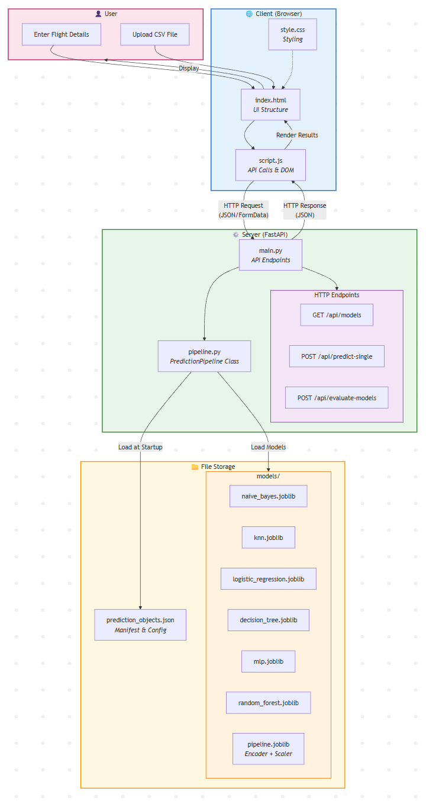

# Flight Cancellation ML Prediction System

<div align="center">

  <p><a href="https://flight-cancellation-ml-prediction.onrender.com" target="_blank"><strong>Test the Live API & Web Client Here</strong></a></p>

</div>

## Project Overview

**Flight Cancellation ML Prediction** is a comprehensive Data Science and Machine Learning project focused on predicting flight cancellations. Leveraging the extensive Flight Delay Dataset (2022), this project encompasses the entire Knowledge Discovery in Databases (KDD) process—from rigorous data profiling and feature engineering to model training, evaluation, and deployment via a modern REST API.

## Features

### Single Flight Prediction
Input individual flight details through a web form to receive instant cancellation predictions. The system automatically handles data transformation and applies the selected model.

### Batch Evaluation
Upload CSV files containing historical flight data to evaluate model performance. The system computes accuracy, precision, recall, and F1-score metrics.

### Multi-Model Support
Choose from six different classification algorithms:
- **Naive Bayes** (GaussianNB)
- **K-Nearest Neighbors** (KNN)
- **Logistic Regression**
- **Decision Tree**
- **Multi-Layer Perceptron** (MLP)
- **Random Forest**

## Technology Stack

| Component | Technology |
|-----------|------------|
| **Backend** | Python, FastAPI |
| **ML Framework** | Scikit-learn |
| **Data Processing** | Pandas, NumPy |
| **Model Persistence** | Joblib |
| **Frontend** | HTML5, CSS3, JavaScript |

## Data Pipeline

The robust preprocessing pipeline (`PredictionPipeline`) applies the following transformations consistently for both training and real-time inference:

1. **Missing Value Imputation**: Mean imputation for numeric features, mode imputation for categorical features.
2. **Type Enforcement**: Numeric coercion and data type standardization.
3. **Cyclic Encoding**: Sine/cosine transformation for temporal features (Month, DayOfWeek, Quarter, Time blocks).
4. **Ordinal Encoding**: Categorical to numeric conversion for string features.
5. **MinMax Scaling**: Feature normalization to [0,1] range.
6. **Feature Selection**: Retention of highly correlated features for optimal model input.

## Architecture & Project Structure



```text
├── client/                 # Frontend web interface (HTML, CSS, JS)
├── models/                 # Serialized ML models and pipeline artifacts (.joblib)
├── server/                 # FastAPI application
│   ├── main.py             # API endpoints and server configuration
│   └── pipeline.py         # Data transformation and inference pipeline
├── Documentation/          # Architecture diagrams and schema documents
├── requirements.txt        # Python dependencies
└── Technical_Analysis_Report.pdf # Comprehensive Data Science and EDA Report
```

## Data Analysis & Technical Report

For a deep dive into the data engineering and model evaluation process, please refer to the **[Technical Analysis Report](Technical_Analysis_Report.pdf)** included in this repository. 

The report covers:
- **Data Profiling**: Analysis of feature distributions, dataset sparsity, and granularity.
- **Data Preparation Methodology**: Step-by-step justification for categorical encoding, missing value imputation, and scaling.
- **Model Evaluation**: Critical analysis of parameter tuning, overfitting, and comparative performance metrics across all models.

## Installation and Setup

### Prerequisites
- Python 3.10 or higher

### 1. Clone the repository
```bash
git clone https://github.com/yourusername/flight-cancellation-ml-prediction.git
cd flight-cancellation-ml-prediction
```

### 2. Set up the virtual environment
**Windows:**
```bash
python -m venv .venv
.venv\Scripts\activate
```
**Mac/Linux:**
```bash
python -m venv .venv
source .venv/bin/activate
```

### 3. Install Dependencies
```bash
python -m pip install --upgrade pip
pip install -r requirements.txt --only-binary :all:
```

### 4. Run the Application
```bash
python -m uvicorn server.main:app --reload
```

Navigate to `http://localhost:8000` in your web browser to access the interactive dashboard.

## API Endpoints

| Method | Endpoint | Description |
|--------|----------|-------------|
| GET | `/api/models` | Returns a list of all available classification models |
| POST | `/api/predict-single` | Single flight prediction |
| POST | `/api/evaluate-models` | Batch model evaluation from CSV upload |
